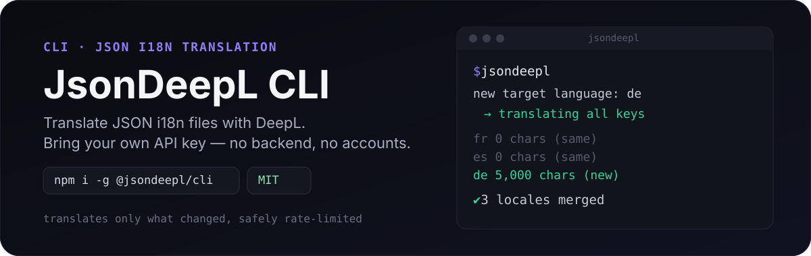
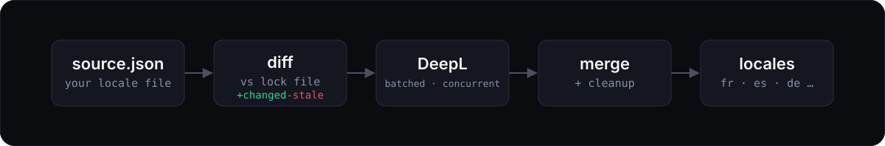

<div align="center">



<!-- automd:badges color=655dc6 -->

[](https://npmjs.com/package/@jsondeepl/cli)
[](https://npm.chart.dev/@jsondeepl/cli)

<!-- /automd -->
[](https://github.com/jsondeepl/cli/actions)
[](LICENSE)

[Installation](#installation) • [Usage](#usage) • [Configuration](#configuration) • [How it works](#how-it-works)

</div>

`jsondeepl` is a CLI that translates JSON i18n files directly through the [DeepL API](https://www.deepl.com/), using your own DeepL API key. There's no account to create, no backend in between, and no usage of ours to pay for — your files and your key talk to DeepL directly.

## Features

- **Direct to DeepL** — your API key is read from an environment variable and used to call DeepL directly. Nothing is ever sent to a server of ours.
- **Incremental by default** — a lock file tracks the last translated state of your source locale, so every run only translates keys that are new or changed, not the whole file.
- **New locales get a full pass** — add a target language for the first time and it's translated from scratch; existing ones only pick up the diff.
- **Interpolation-safe** — `{{mustache}}`, `{braces}`, and `:blade`-style placeholders are protected before sending text to DeepL and restored after, so your variables never get mangled or translated.
- **Batched and rate-limit-aware** — translation requests are batched and all target languages run concurrently, but every request is funneled through a shared limiter so you never hit DeepL's rate limits no matter how many languages you're translating into.
- **Quota-aware** — shows your real DeepL character usage before spending it, and warns (or asks to confirm) if a run might push you over your limit.
- **History, not just overwrites** — every run's output is snapshotted under `jsondeepl/history/`, so you can always see exactly what changed and when.

## Installation

Run it with `npx` and you're always on the latest version — no install required:

```sh
npx @jsondeepl/cli@latest
```

Or install it globally / as a dev dependency if you'd rather pin a version:

```sh
npm i -D @jsondeepl/cli
# or: pnpm add -D @jsondeepl/cli
# or: yarn add -D @jsondeepl/cli
# or: bun add -D @jsondeepl/cli
```

## Usage

### 1. Initialize

Run it once at the root of your project:

```sh
jsondeepl
```

This creates a `jsondeepl/` directory and a `jsondeepl/config.json` file, then stops so you can review it — set your source/target languages and `langDir` before continuing.

### 2. Set your DeepL API key

```env
# .env
DEEPL_API_KEY=your-deepl-api-key
```

Get a free key at [deepl.com/your-account/keys](https://www.deepl.com/en/your-account/keys) — the free tier works fine for most projects.

### 3. Run it

```sh
jsondeepl
```

This extracts what's changed, translates it, and merges the result into your locale files.

> [!WARNING]
> `jsondeepl` merges into and overwrites files in `langDir`. Make sure you don't have uncommitted changes there before running it, so you can always diff or revert with Git if something looks off.

> [!TIP]
> Add `jsondeepl` to a `postbuild` or CI step once your `langDir` is set up, so translations stay in sync automatically as your source strings change.

## Configuration

`jsondeepl/config.json` is created with sensible defaults on first run:

```json
{
  "source": "en",
  "target": ["fr", "es", "de"],
  "langDir": "./i18n/locales",
  "formality": "prefer_less",
  "options": {
    "prompt": true
  }
}
```

| Field | Required | Description |
| --- | --- | --- |
| `source` | Yes | Source locale code to translate from (case insensitive). |
| `target` | Yes | Array of target locale codes to translate into (case insensitive). |
| `langDir` | Yes | Directory containing your `{locale}.json` files. |
| `formality` | No | `"prefer_less"` (default) or `"prefer_more"` — passed straight through to DeepL where the target language supports it. |
| `options.prompt` | No | Defaults to `true`. Set to `false` to skip confirmation prompts — useful for CI and automation. |

<details>
<summary>Supported language codes</summary>

`source`/`target` codes aren't hand-maintained — they're re-exported directly from the [`deepl-node`](https://github.com/DeepLcom/deepl-node) SDK, so the list of supported languages always matches whatever DeepL currently supports.

</details>

## How it works



1. Your source locale file is parsed and diffed against `jsondeepl/{source}-lock.json`, the last-translated state, to find only new or changed keys.
2. Each target language in `config.json` is checked against `langDir`: if its file doesn't exist yet, it's a **new language** and gets the full source; if it already exists, it's **incremental** and only gets the diff.
3. Character counts are totaled per language and checked against your real DeepL usage — you'll see a warning (and an optional confirmation prompt) if the run might exceed your quota.
4. Translation happens directly via DeepL, batched per request, with all target languages translating concurrently under a shared rate limit.
5. The lock file is updated, translations are merged into your existing locale files, and any key that no longer exists in the source is removed from every target file — keeping them from drifting out of sync over time.

Every job's result is also saved under `jsondeepl/history/{timestamp}/`, so nothing is ever silently overwritten without a record of what changed.

## Development

<details>
<summary>Local development setup</summary>

- Clone this repository
- Install the latest LTS version of [Node.js](https://nodejs.org/en/)
- Enable [Corepack](https://github.com/nodejs/corepack) with `corepack enable`
- Install dependencies with `pnpm install`
- Run `pnpm dev` to run the test suite in watch mode
- Run `pnpm test` to run the full suite (lint, type-check, tests with coverage) once

</details>
